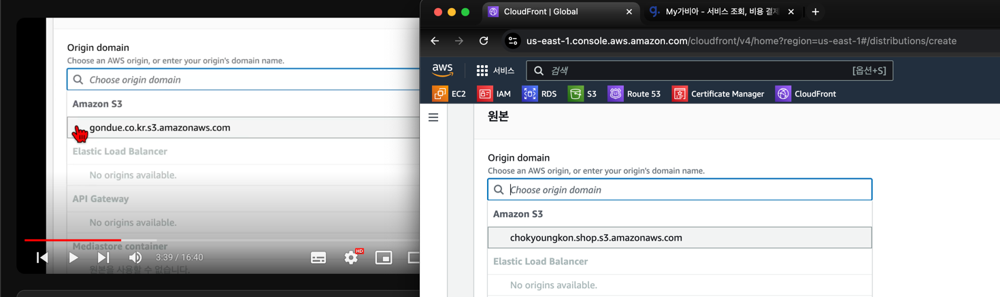

### SSH / TLS 인증서 발급받기

### aws- Certificate Manager
- SSL/TLS 인증서를 손쉽게 프로비저닝, 관리, 배포 및 갱신 

certificate manager 켜기
오른쪽 상단 지역 - `버즈니아 북부` 로 하기 us-east-1

완전 정규화된 도메인 이름
-> 구매한 도메인 주소 치기   : chokyoungkon.shop
맨 아래 요청 ㄱ

상태  - 검증 대기 중    인데 따로 검증 요청해야함!

서비스 -> CloudFront (글로벌 콘텐츠 전송 네트워크) 검색

origin domain -> 눌러서 선택할 것 누르기 s3에 걸려있는 것 누르기
알람창 웹사이트 엔드 포인트 사용

뷰어 -> Redirect HTTP to HTTPS

캐시 정책

CachingDisabled

웹 애플리케이션 방화벽(WAF)
보안 보호 비활성화

기본값 루트 객체 - 선택 사항
/index.html

맨 하단 -> 배포생성

---

오류페이지 탭
사용자 정의 오류 응답 생성 클릭 

403 에러 뜨면 
/index.html
200확인
: 403 뜨면 에러로 하지말고 그냥 넘겨라

사용자 정의 오류 응답 생성 버튼 클릭

--- 

다시 일반 탭

주소 있는거  붙여넣으면 열린다~!

---
AWS Certificate Manager -인증서 나열 켜기
지역을 다시 버지니아 북부로 설정하기

인증서 클릭

창 켜진채로 Route 53 서비스 클릭
좌측 
호스팅 영역 클릭
보이는 도메인 클릭

레코드 생성
레코드 유형 CNAME
 아까 인증서에서 cname복사 붙여넣기~!
하고 뒤에 도메인 찍힌거 지우기~!

값에는 인증서에 있는 CNAME값 넣기~!
넣고 하단에 레코드 생성

생성하면 레코드 총 4개 된거고

가비아로 이동하기~!
my 가비아 -도메인 클릭
dns관리툴 -보이는 것 오른쪽 끝에 `설정` 클릭

DNS 설정 옆 `레코드 수정` 버튼 클릭
누르고 레코드 추가 

타입 CNAME 
아까처럼 이름/ 값 넣고 상태 쪽에 확인 누르고 
그 아래 저장 클릭

AWS Certificate Manager  > 인증서
클릭해서 보면 검증 대기중에서 검증 완료 되면 바뀜~!
ㄴ가비아에서 승인하면 바뀜

다시 cloudfront 들어가서 
일반에 설정 누르기

CloudFront
뜬거 누르고 일반탭
내려보면 설정쪽 가서 편집 누르기

---

custom SSL certificate 가서
인증서 추가하기

ACM인증서로 나타남! 인증 완료되면 보이는듯?
ㄴ 추가 후  맨 아래 변경사항 저장

---
 
다하고 ROUTE 53 들어가서
A 유형 앞에 체크하고
우측에 레코드 편집 버튼 클릭

돋보기 누르기
s3 아래 뜬걸로 바꾸기

S3 웹 사이트 엔드 포인트에 대한 별칭 -> CloudFront 배포에 대한 별칭
으로 변경하기
배포선택
에서

