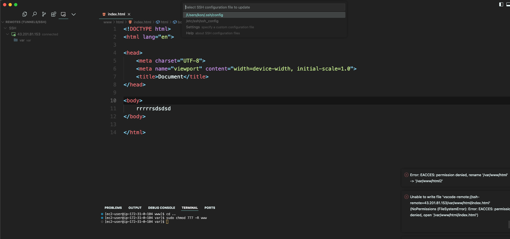
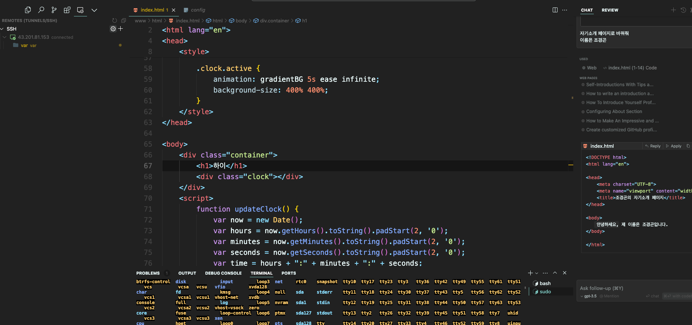
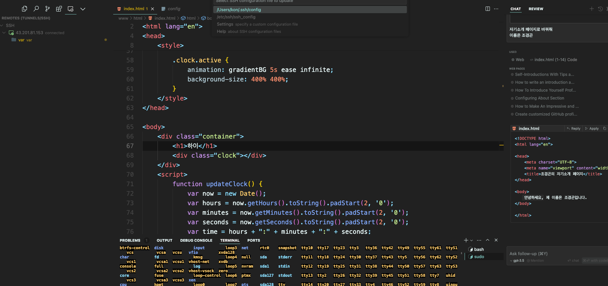

ㄴ remote ssh 설치

config 열기

Host 에 아이피   호스트 네임: 아이피
IdentityFile 키 위치 경로 + 키 이름
User 는 ec2-user
--- 
Host 43.201.81.153
        HostName 43.201.81.153
        IdentityFile ~/konFolder/key/keyP.pem
        User ec2-user
--- 
