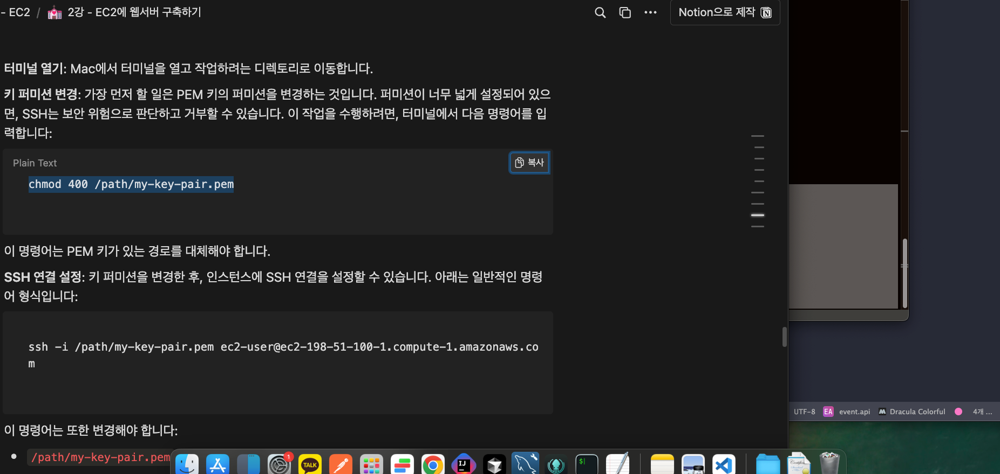
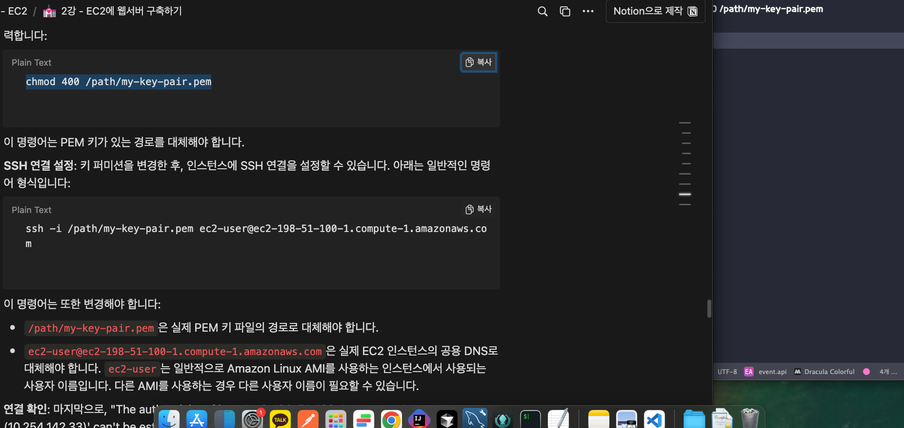
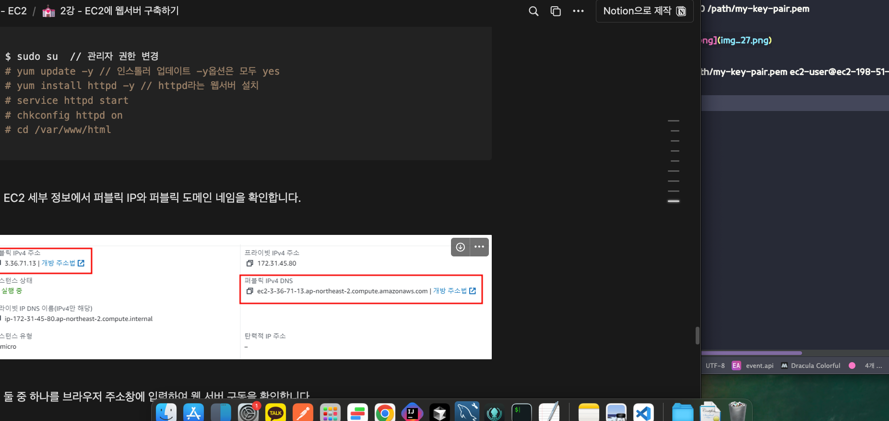

sudo yum install git
- 깃 설치

:wq
- vi 나가기 명령

chmod 400 /path/my-key-pair.pem

주소는 퍼블릭 ipv4 주소
ssh -i /path/my-key-pair.pem ec2-user@ec2-198-51-100-1.compute-1.amazonaws.com

[터미널]
kon@konui-MacBookAir  ~/Downloads  chmod 400 Test_Ec2_key.pem
kon@konui-MacBookAir  ~/Downloads  ssh -i Test_Ec2_key.pem ec2-user@퍼블릭 주소

---
###  접속 후 작업
$ sudo su  // 관리자 권한 변경
# yum update -y // 인스톨러 업데이트 -y옵션은 모두 yes
# yum install httpd -y // httpd라는 웹서버 설치
# service httpd start
# chkconfig httpd on
# cd /var/www/html

