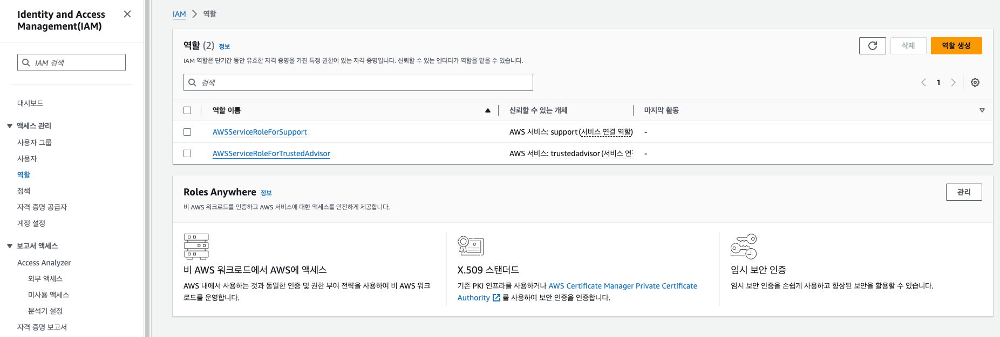
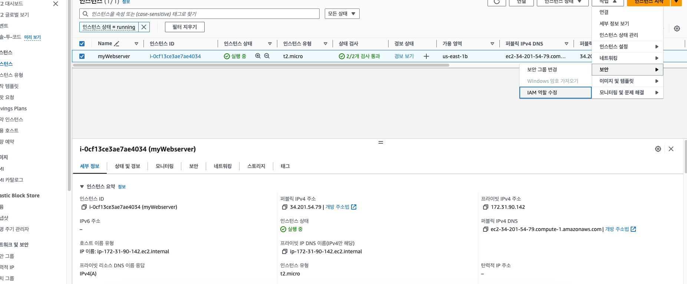

역할생성

ec2 다음

iam 검색
역할 선택-> 생성

IAM 역할 업데이트

리눅스 터미널
명령어 aws iam list-roles

리눅스 터미널 명령어: 
aws iam list-users

결과
{
"Users": [
{
"Path": "/",
"UserName": "nilanila",
"UserId": "AIDA2UC3DI4E55YXWYKSM",
"Arn": "arn:aws:iam::730335495945:user/nilanila",
"CreateDate": "2024-07-18T01:02:31+00:00",
"PasswordLastUsed": "2024-07-18T01:04:43+00:00"
}
]
}

---
