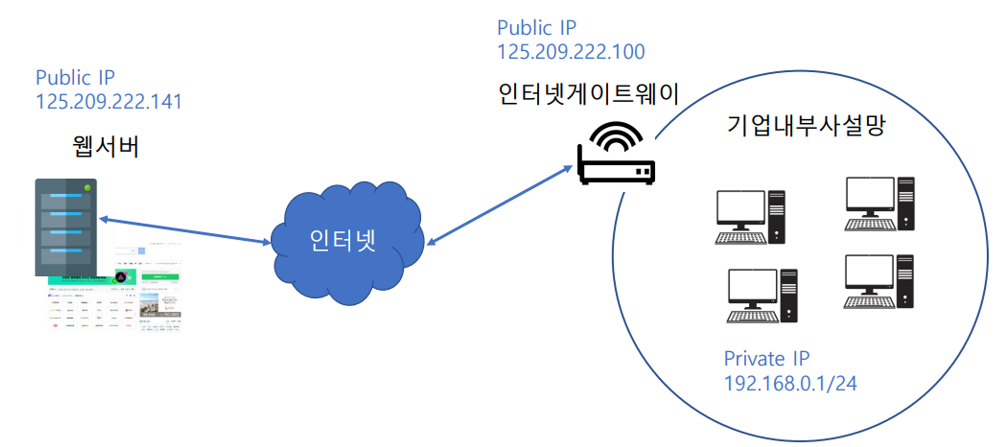

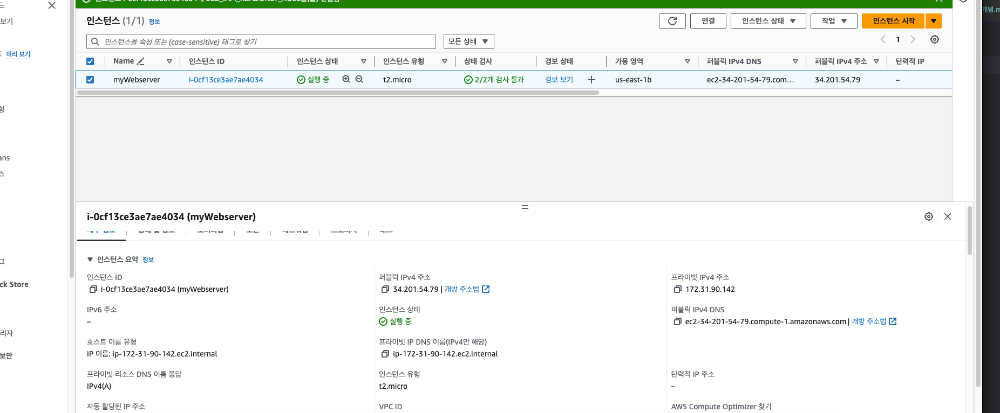
퍼블릭: 외부
프라이빗 : 내부망

인스턴스 중지: ip 빼앗김! 
다시 시작하면 재발급!

탄력적 Elastic ip 로 인스턴스 중지해두면 과금됨!
ㄴ고정해두는 건데 돈 => 벌금형

탄력 ip 를 반납 안하고 지워야함!!@@ 
ㄴ 반납 안하고 지우면 돈나감

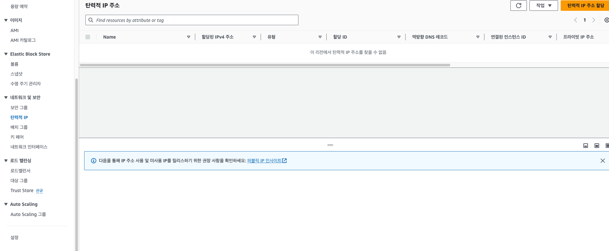

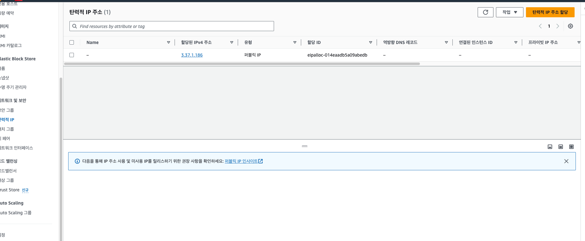
할당 반드시해야함

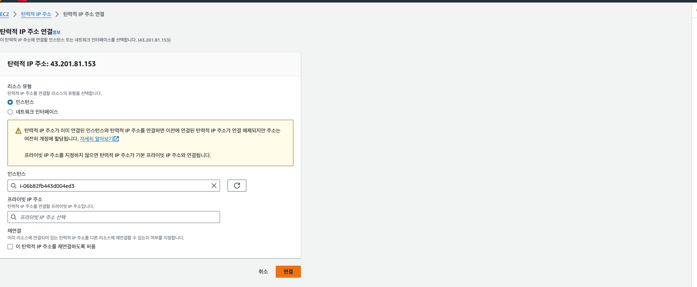
인스턴스 고르면 됨

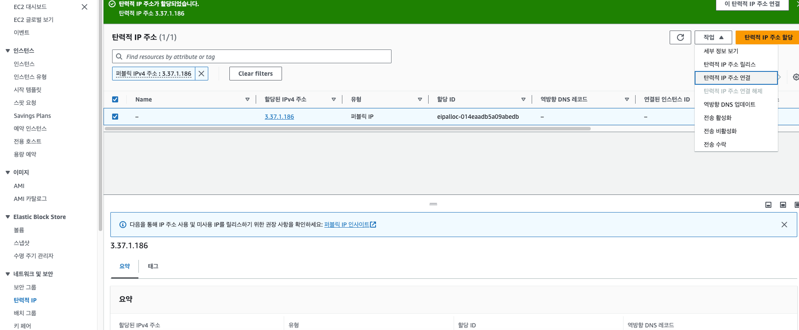
ㄴ 이거 안하면 과금!!!!

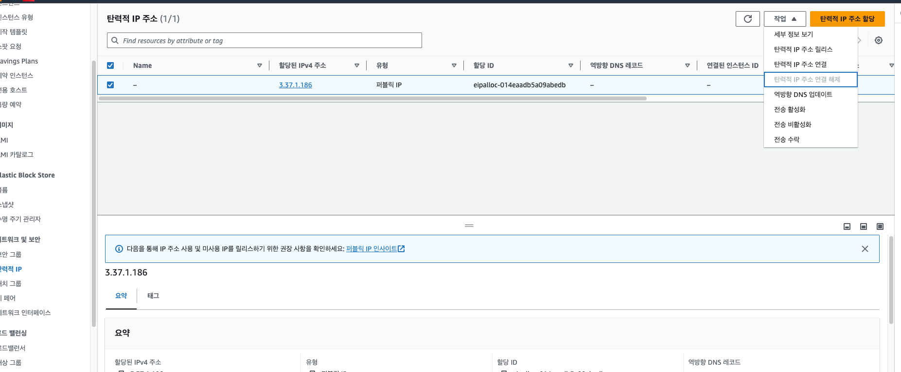
할당된거 해제 부터 하기

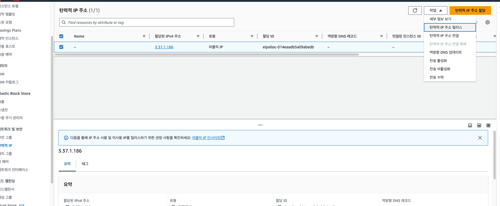
릴리스 하면 반납됨!!

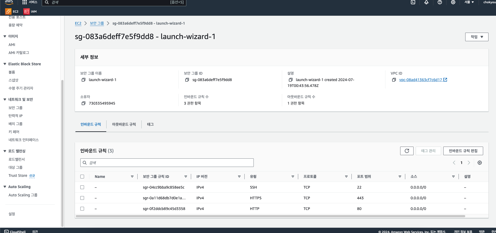
보안그룹
소스 0.0.0.0 이 모두에게 허용된거
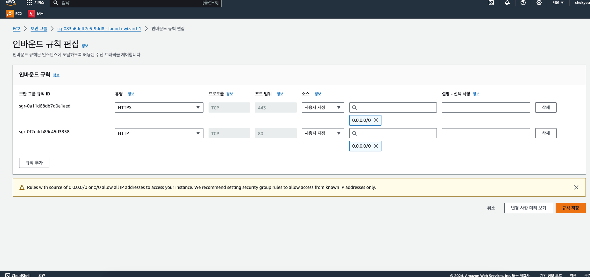

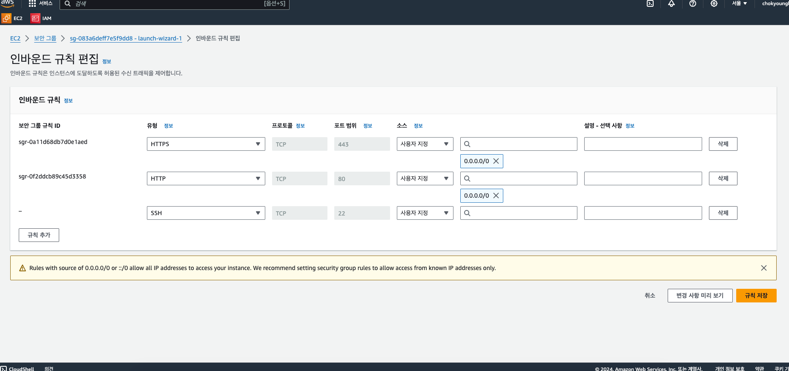
규칙 지우고 삭제 가능!

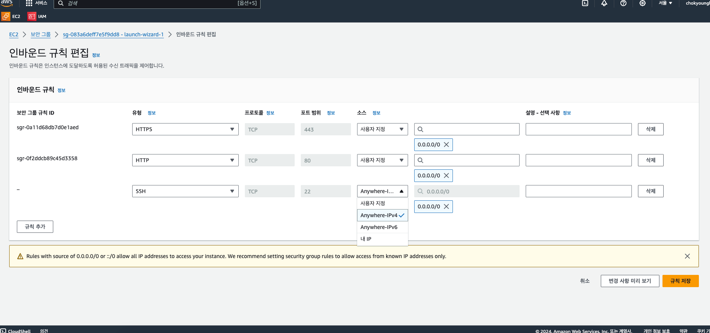
공개 범위도 설정!

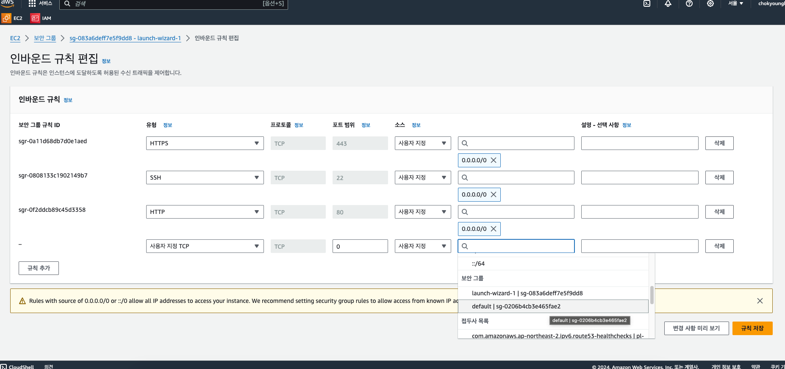
다른 곳에서 설정한 보안그룹을 불러올 수 있다~!

