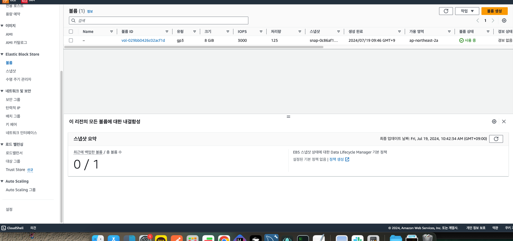

 
- EC2에 연결하여 사용하는 블록 스토리지
- EC2 인스턴스 시작 시 AMI가 설치 되는 EBS 루트 볼륨이 생성됨
- EC2 종료 후 EBS가 같이 삭제 되지 않으면 사용 비용이 청구 됨
- 여러 개의 EBS 볼륨을 생성하여 EC2에 추가 연결 가능
- EBS와 EC2는 동일한 가용영역에 있어야 연결 가능
- 수명 주기 관리자(Data Life Cycle Manager) 정책을 통해 스냅샷 생성 일
  정을 자동화 가능
- AWS Key Management Service (KMS)를 이용해 EBS 볼륨 암호화 가능

가용영역을 맞춰야함~

볼륨 생성
30기가 까지만 공짜~!

볼륨 연결 인스턴스 선택

볼륨명 선택

하드 추가 완료₩!

볼륨 강제 분리
그리고 삭제

스냅샷!

백업~!