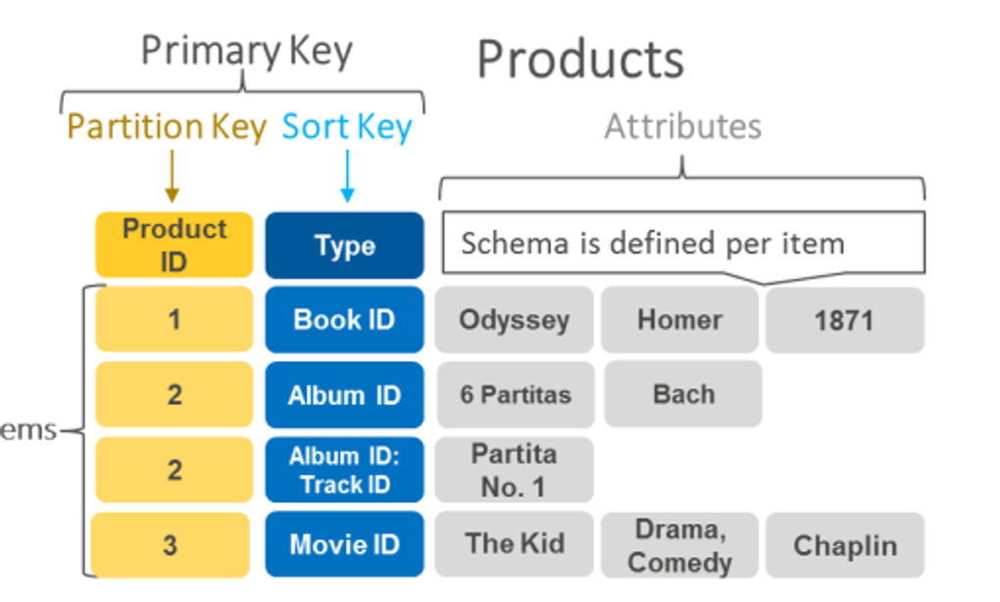
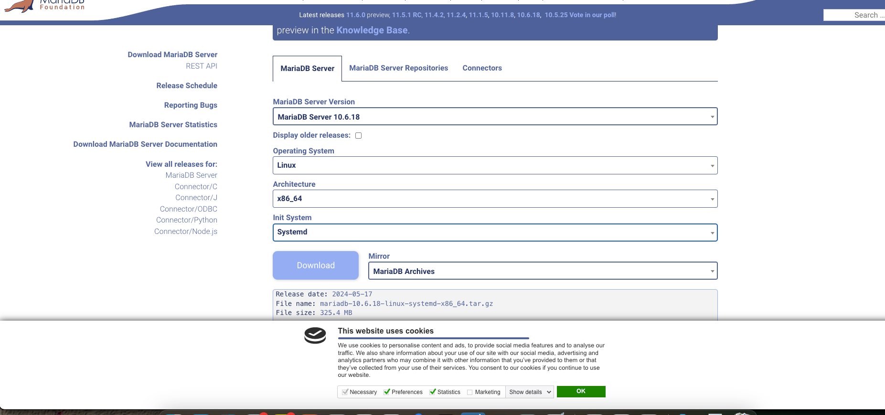
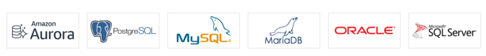
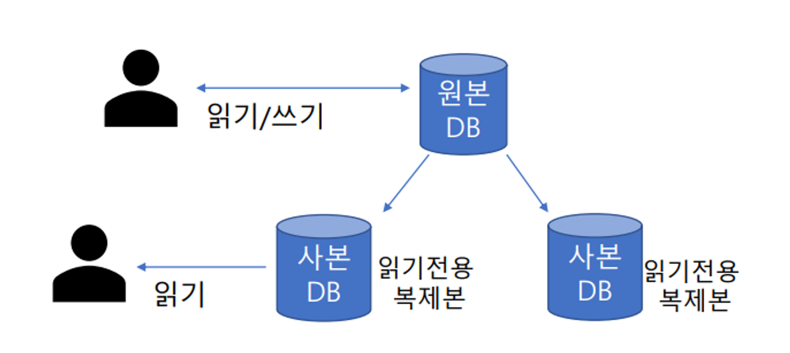
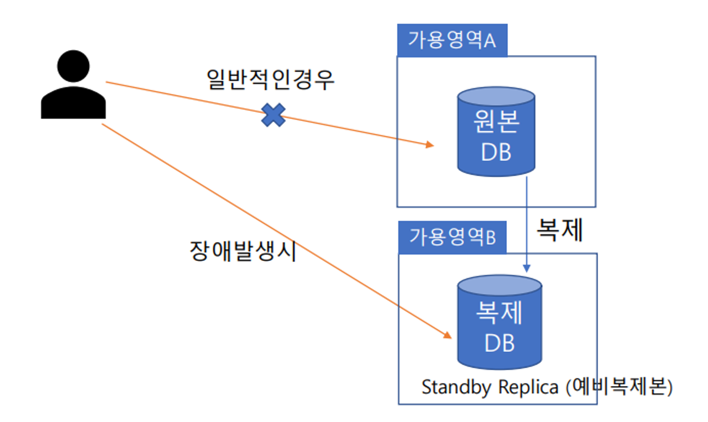

- NoSQL = non-SQL = non relational databases
- 관계 구조를 갖지 않는 데이터베이스 관리 시스템
- 관계 구조가 없기에 대규모의 데이터를 유연하게 처리할 수 있는 것이 강점
- NoSQL 데이터 베이스는 Key-Value Database, Document Database, Column Family Database, Graph Database 종류가 있음
- 대표적인 AWS Key-Value 데이터 베이스는 Amazon DynamoDB

//---->
https://mariadb.org/download/?t=mariadb&p=mariadb&r=11.4.2
마리아 디비 다운

//<----
ㄴ근데 이렇게 설치 안하고
    아마존 RDS 깔면 다해준다~!

아마존 RDS

- AWS 관리형 관계형 데이터 베이스 서비스 (Relational Database Service)
- 하드웨어 프로비저닝, 데이터베이스 설정, 패치 및 백업을 AWS에서 관리
- Aurora, PostgreSQL, MySQL, MariaDB, Oracle, SQL Server 등의 RDS 엔진을 AWS에서는 제공
- SQL 쿼리를 이용하는 데이터 베이스 용도에 사용
- DB 다운타임 없이 스토리지 용량 자동으로 확장 가능 (Storage Auto Scaling)
- DB 인스턴스 백업 및 복구를 위한 두 가지 방법인 자동 백업 및 데이터베이스 스냅샷(DB 스냅샷)을 제공
- SSL/TLS를 사용하여 애플리케이션과 DB 인스턴스 간의 전송 중 암호화 가능
- AWS Key Management Service(KMS)를 통해 관리하는 키를 사용하여 모든 데이터베이스 엔진에 대한 저장 중 암호화 가능

RDS – 읽기 전용 복제본 (Read Replica)

- 읽기만 가능한 DB 인스턴스의 복제본을 여러 개 만드는 기능
- 읽기를 별도로 분리하여 성능을 향상
- 원본 DB의 읽기/쓰기 트래픽을 분산시켜 성능 향상
- SQL쿼리를 많이 하는 리포팅 툴의 경우 읽기 복제본으로 연결하여 쿼리 성능 향상

RDS – 다중 AZ (Multi-AZ)

- 데이터 베이스를 여러 가용영역에 배치 하는 것
- 내구성과 가용성을 향상 시킬 수 있음 (RDS 데이터베이스 다운타임이 가장 적게 할 수 있음)
- 한곳의 DB가 장애 발생하면 다른 곳으로 자동연결 하도록 장애 조치 수행

Aurora
- RDS 호환형 관계형 데이터 베이스
- RDS에서 제공하는 읽기전용 복제본, KMS암호화, 스냅샷 백업, 오토스케일링 등을 제공
- AWS에서 만든 서비스로 다른 RDS보다 저렴한 비용에 성능이 더 뛰어남
- 다른 RDS보다 속도는 3-5배 빠름
- 데이터베이스 설정, 패치 적용 및 백업과 같은 관리 태스크를 자동화
- 개별 DB 인스턴스 기반이 아닌 여러 인스턴스를 하나로 운영하는 클러스터 DB 기반으로 구성 됨
- DB 인스턴스 운영 및 데이터 베이스 용량을 수동으로 관리 하지 않는 서버리스 RDS 서비스인 Aurora Severless 사용가능

