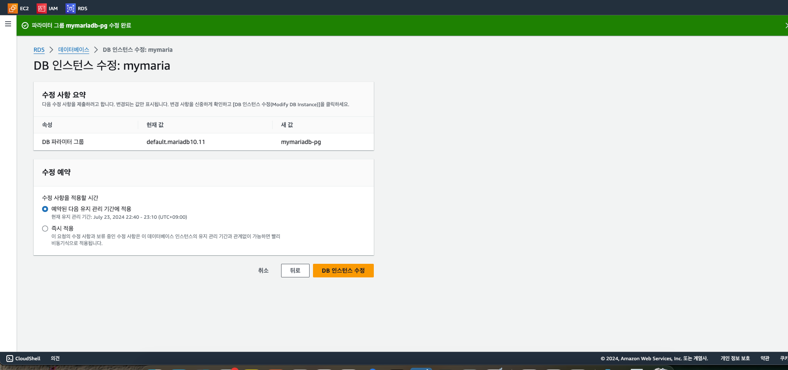

디비 생성
마리아 디비 (무료)
오라클 (유료)

템플릿 프리티어 해야함!

스토리지 자동 조정 가서 
자동 조정 활성화 무조건 꺼라 
잘못하다간 과금 !!!!

ec2 컴퓨팅 리소스에 연결 (일단 끔)
ㄴ 이거 하면 바로 쿼리 쓸 수 있다
인스턴스도 연결

---

연결안함
퍼블릭 엑세스  - 예  : 로컬에서 접속하는거

root
mariadb1234

db 가 now 하면 이상한 시간이 나오니
설정이 필요해서
파라미터 그룹

편집

time_zone 검색
char 검색

utf8mb4

collection검색후
utf8mb4_general_ci

디비 -> 수정

즉시적용 -> db 인스턴스 수정

로컬 호스트에 엔드포인트 복붙
아이디비밀번호 맞추기

디비 계정 만들기# 
create user kim1234 identified by 'kkk1234';
grant all privileges on teamprj.* to 'kim1234';
