## DynamoDB

- NoSQL 데이터베이스 서비스
- 키-값, 문서 데이터 모델 지원
- 서버리스 서비스  : 서버를 직접 안만들어도 ㅇㅇ이 다 만들어준다.!⭐️
- 용량에 맞게 자동으로 확장 및 축소(Auto Scaling) 하므로 관리 및 운영 오버헤드 최소화
- 10밀리 초 미만의 빠른 응답을 제공
- 초당 수백만개 이상의 요청 처리 가능
- 지연시간이 짧은, 빠른 응답이 필요한 애플리케이션에 사용
- 쇼핑몰 장바구니, 은행 트랜잭션, 게임 플레이어 기록 저장 등에 사용

## Database Migration Service (DMS)

- 데이터 베이스를 마이그레이션 하는 서비스 (DB -> DB)
    ㄴ 디비를 옮기는 작업~!
- 온-프레미스에서 AWS 또는 AWS내에서 마이그레이션 가능
- 원본 DB를 사용하는 중에도 지속적으로 마이그레이션 가능
- 같은 종류 및 서로 다른 종류 DB도 마이그레이션 가능
  - 이 기종의 DB는 Schema Conversion Tool(SCT)를 이용해
     데이터 스키마를 마이그레이션 대상 DB에 적합하게 변환해야 함
     같은 종류의 DB는 데이터 변환 필요 없음

디비 접속하기 리눅스~⭐️
mysql -u root -p -h mymaria.ctg806g240bs.ap-northeast-2.rds.amazonaws.com

mysql> show variables like 'c%';
+----------------------------------+----------------------------------------------+
| Variable_name                    | Value                                        |
+----------------------------------+----------------------------------------------+
| character_set_client             | utf8mb4                                      |
| character_set_connection         | utf8mb4                                      |
| character_set_database           | latin1                                       |
| character_set_filesystem         | utf8mb4                                      |
| character_set_results            | utf8mb4                                      |
| character_set_server             | utf8mb4                                      |
| character_set_system             | utf8mb3                                      |

👽검색하면 라틴인게 있다!

mysql> alter database teamprj character set = 'utf8mb4' collate = 'utf8mb4_general_ci';
Query OK, 1 row affected (0.01 sec)
👽 utf8 로 캐릭터 변경
버킷 만들기   지역별 요금 다름!
myaws-s3-bucket9955-1

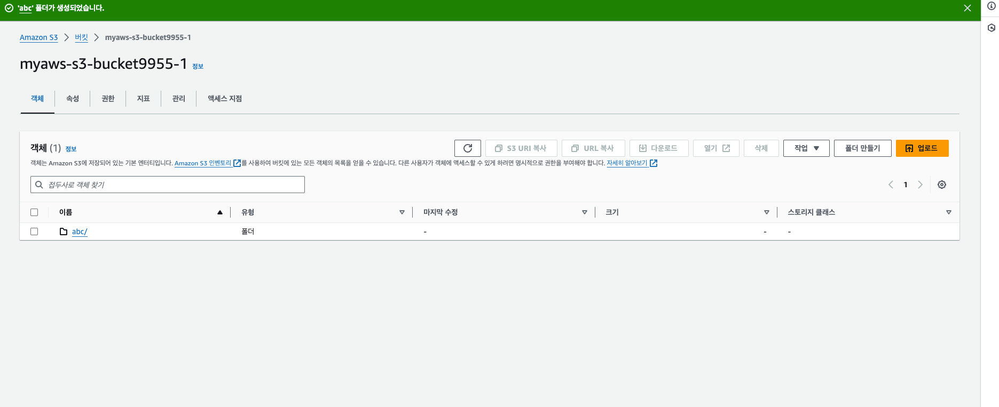
사진 버킷으로 올리고 열기 누르면 url 이 생긴다~!🌟

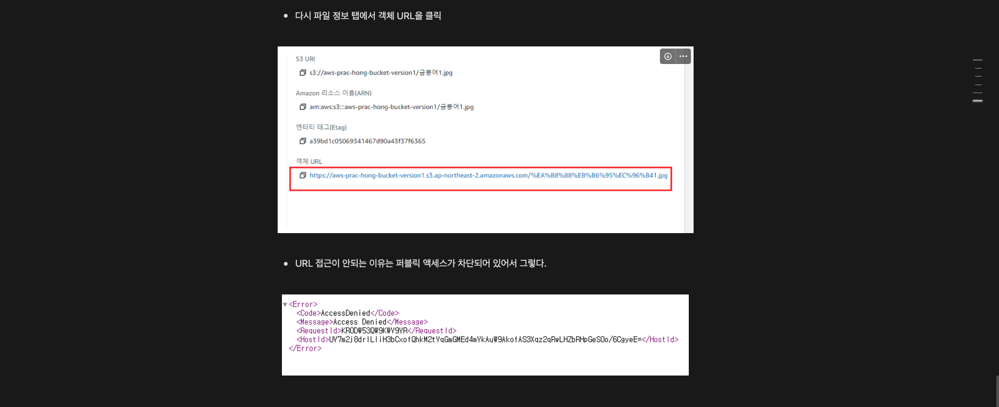
url

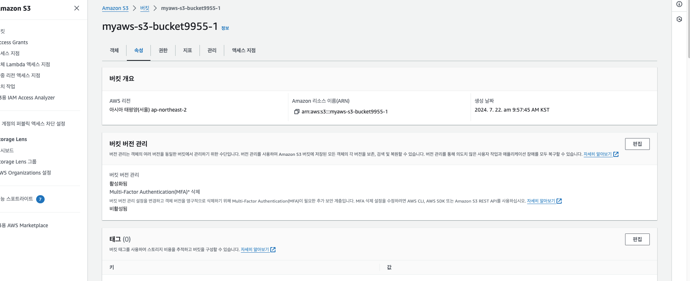
속성 - 버전관리 편집 -활성화 => 버전관리

사진 권한 주기₩!
step1 권한 풀기~!
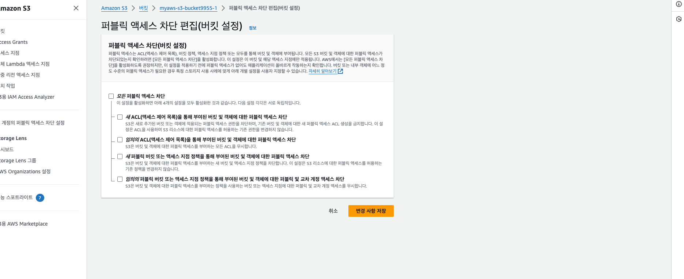
step2 버킷 정책 편집 허용하기 
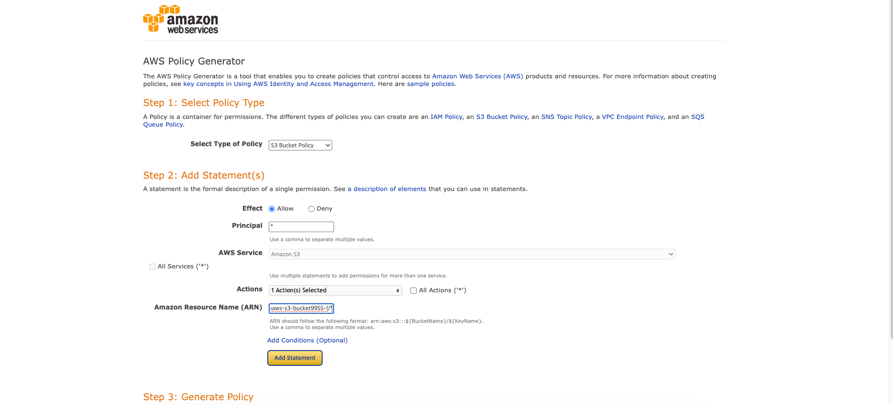

arn은 
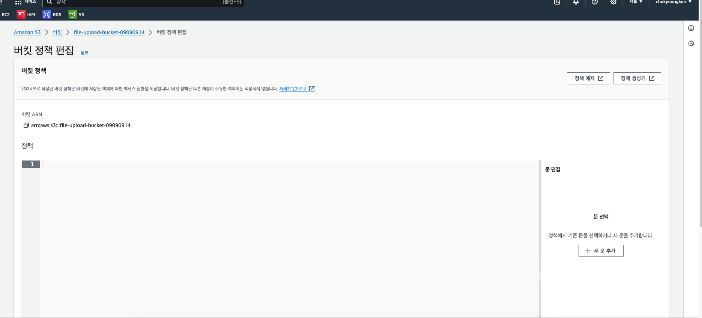
사진에서 있는거 복사하고
/* 을 뒤에 입력!
항목 선택할때는 getobject
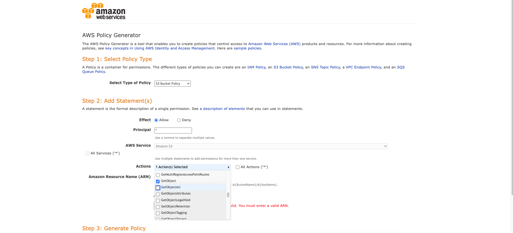

---
결과
url로 사진을 복사해서 사용할 수 있따~!
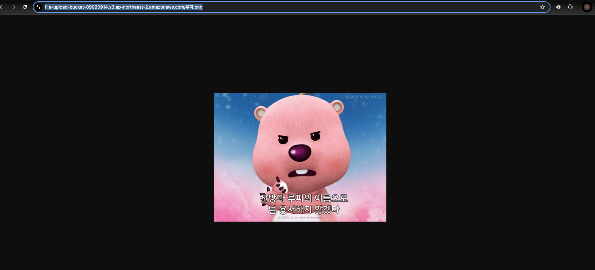

iam -> 사용자-> 콘솔 어쩌고 설정+ 암호 지정 다음
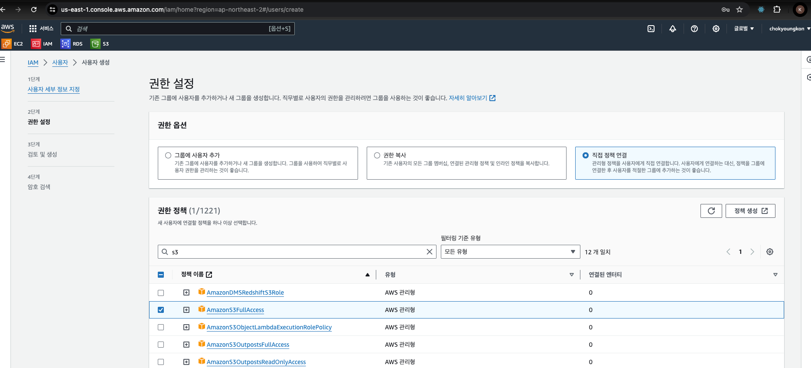
직접 정책 연결 -> amazonS3FullAccess 

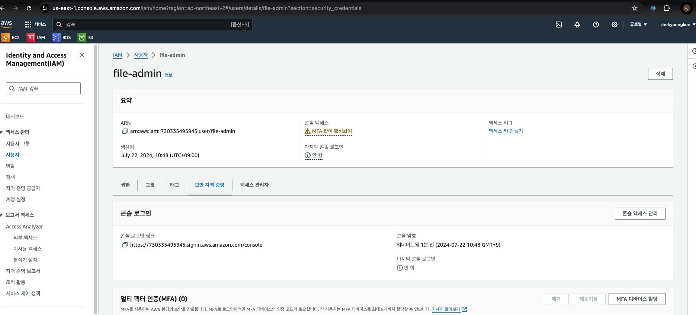

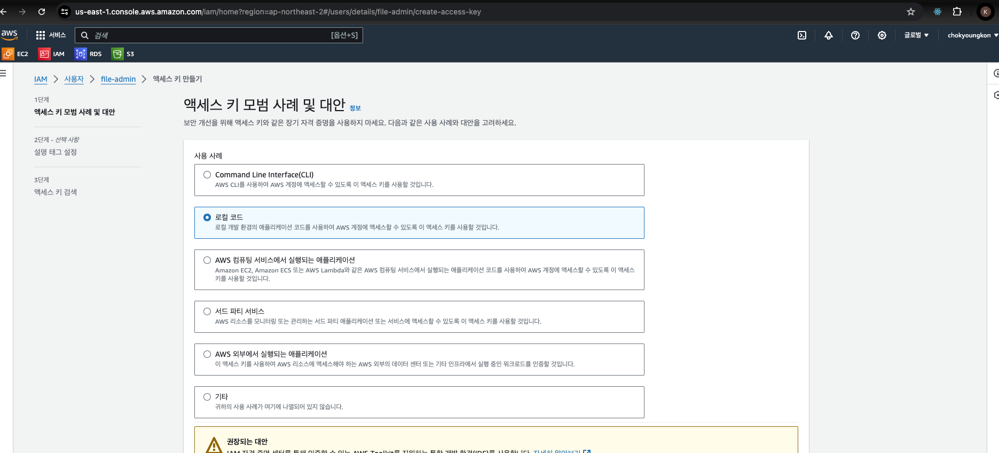
로컬 코드 

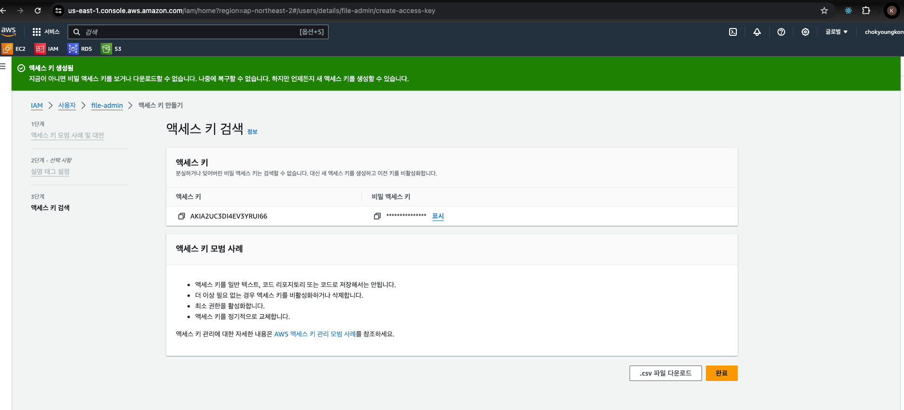
ㄴ 지금 화면에서 나가면 다시는 못봄
ㄴ 다운로드 해놓기 하단 csv

---
event.api 코드 포스트맨
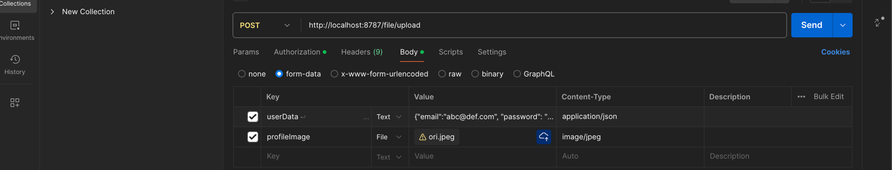
