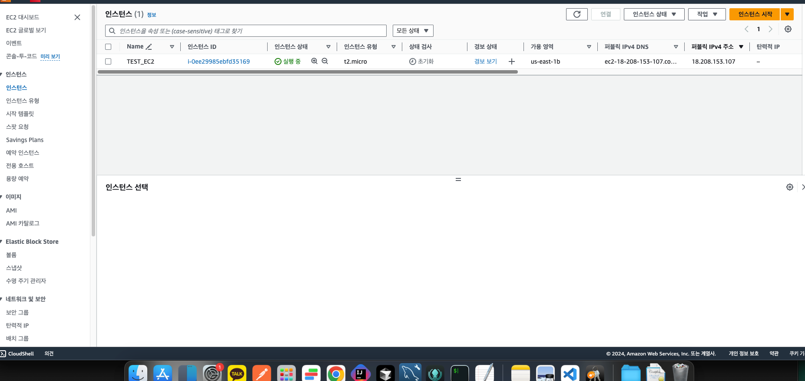

 온-프레미스 데이터 센터 : 실제 데이터 센터 

---
자격증 개발 분야 따는 등급 :  associate
developer /   solutions architect
두개 정도 개발자들이 딴다 => 2달정도면 땀
문제 다 객관식
클라우드 = 미래 먹거리
추천 : 프로페셔널 5-6개월
---
문제: 한글인데, 번역투
학원에서 시험봄

---

각각의 지역을 리전이라함

EC2  가상서버 
영역 이름: 가용 영역

캐싱 개념: 다른 사람이 영상을 누름 한국 서버로 다운되어 2번째 유저부터는 빠르게 본다

IAM 

iam 사용자 생성

그룹으로 권한 관리

멀티팩터 인증 otp

EC2 = 컴퓨터를 사는 것과 같다
E = 엘라스틱 : 탄력적인

 프리 티어 사용 가능 만 무료임 
1년이 지나면 돈 나가니 잘 생각!

.pem : 리눅스, 맥
.ppk : 윈도우

소스 유형 : 위치 무관 : 어디서나 접근 가능

ssh, http, https

용량 설정

과금의 시작  프리티어

인스턴스 중지 :    중지
인스턴스 종료는 : 삭제

## EC2 원격 접속 방법

### Secure Shell Protocol(SSH)를 사용한 연결

- SSH 프로토콜을 이용해 Linux 인스턴스에 원격으로 연결
- SSH(Secure Shell Protocol)은 보안을 통해 원격으로 접속하기 위한 방식
- 아이디, 패스워드 방식이 아닌 Public Key와 Private Key를 이용해 접속
- 원격 접속 방법: MAC PC의 Terminal, 
  -                     Windows Powershell, Windows Putty 프로그램 등을 사용
  

오른쪽상단에 연결로도 접속이 되는데, 그닥 쓰는 방법은 아님!

