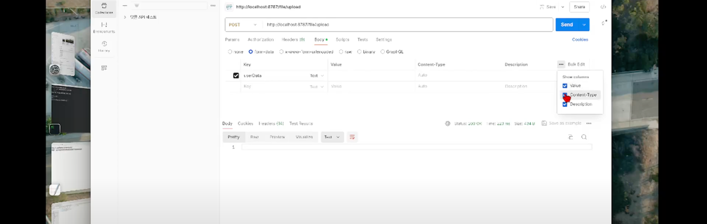
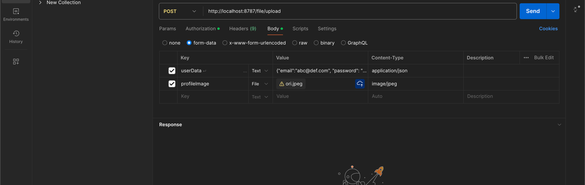

// 파일 업로드 처리
json 과
파일 이미지를 다 받는 방법!
@RequestPart

포스트맨 전송전 체크

포스트맨 전송 화면

```dtd

// 파일 업로드 처리
@PostMapping("/file/upload")
public ResponseEntity<?> upload(
//여기는 json으로 받고
@RequestPart(value = "userData", required = false) EventUserSaveDto dto,
//여기는 이미지로 받고
@RequestPart(value = "profileImage") MultipartFile uploadFile
) {
```

yml 세팅
```dtd
SPRING: 다음 계층에 추가
#upload setting
servlet:
multipart:
max-file-size: 3MB # 1개의 파일의 최대 용량
max-request-size: 20MB # 1번의 요청에 보낼 수 있는 최대 용량
```

```dtd
#s3 setting
aws:
    credentials:
        accessKey: 개인키
        secretKey: 비밀키
    region: ap-northeast-2 (리전)
    bucketName: spring-file-bucket09140914 (버킷 이름)
```
---
AwsS3Service.java 
ㄴ 여기서는 aws 관련 인증을 처리함
---
```dtd

    // AWS S3에 접근하여 인증
    @PostConstruct // 본 서비스객체가 생성될 때 단 1번 실행
    private void initAmazonS3() {
        // 액세스키와 비밀키로 사용자 인증
        AwsBasicCredentials credentials = AwsBasicCredentials.create(accessKey, secretKey);

        this.s3 = S3Client.builder()
                .region(Region.of(region))
                .credentialsProvider(StaticCredentialsProvider.create(credentials))
                .build();
    }

```

