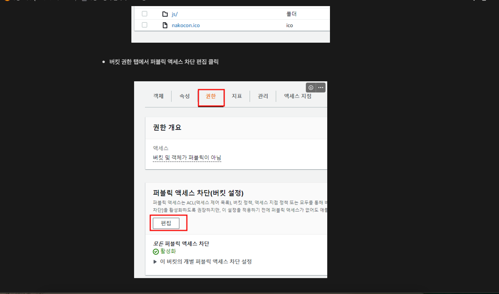
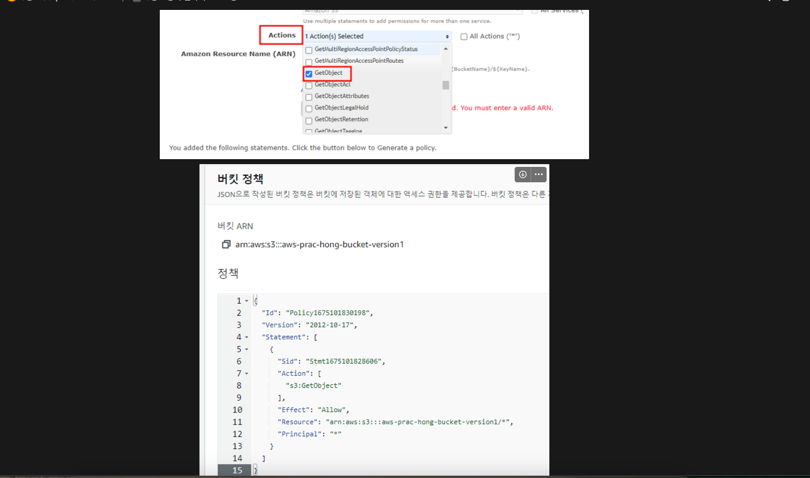
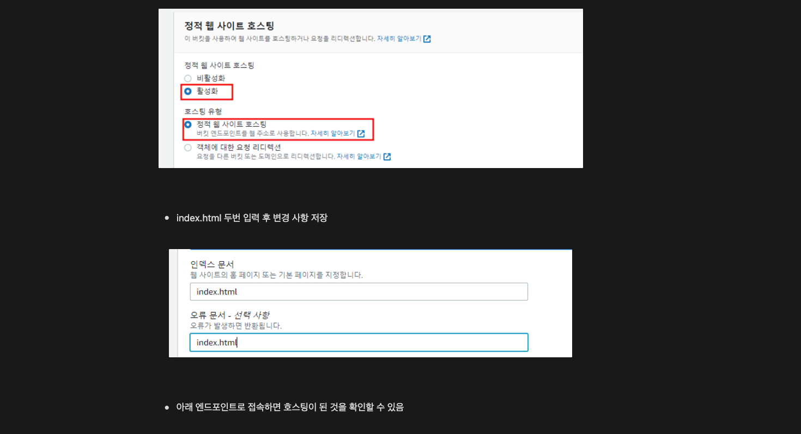
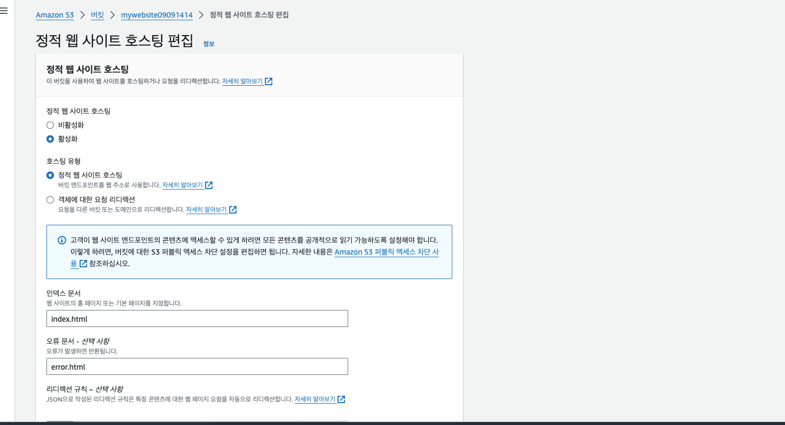
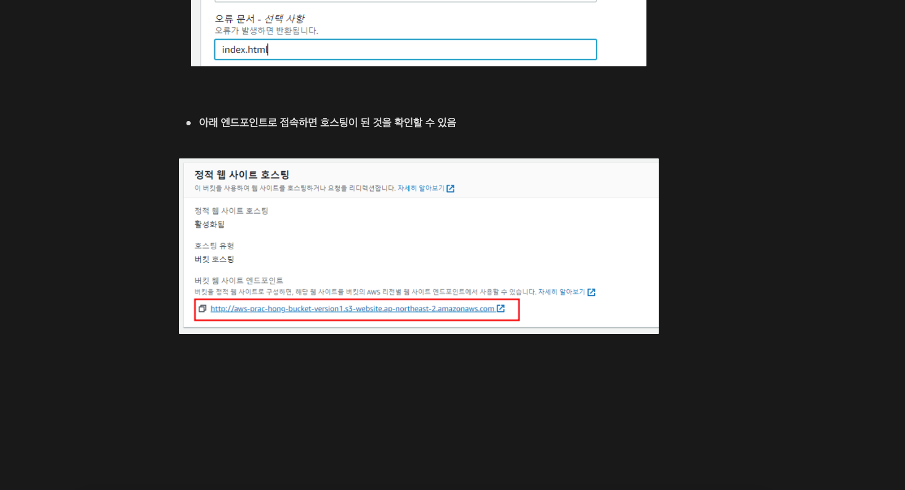
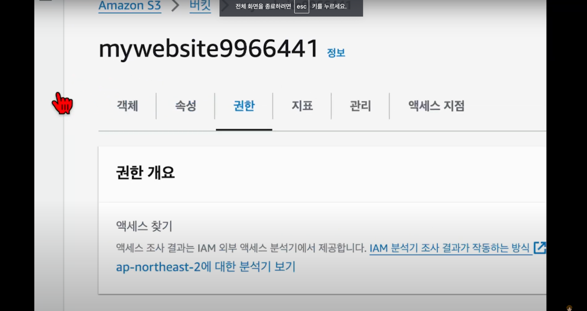
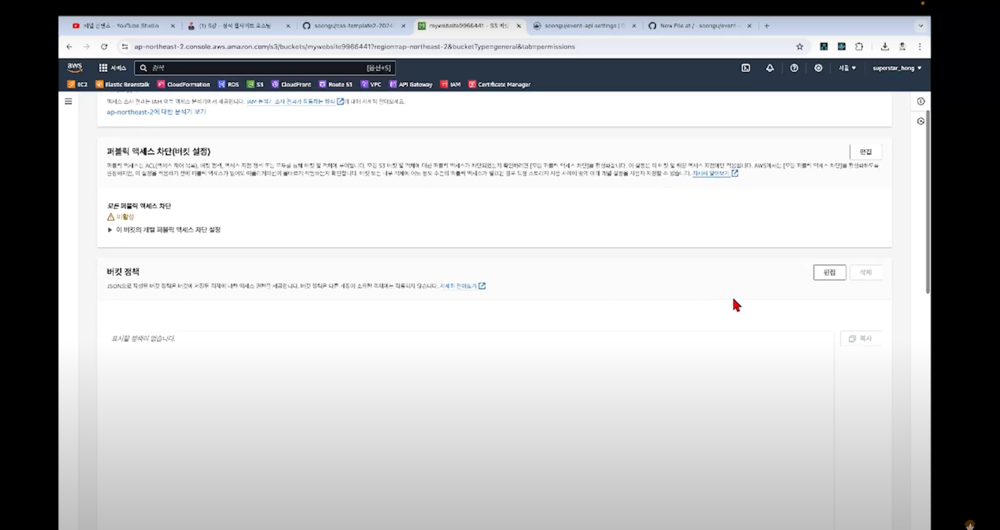
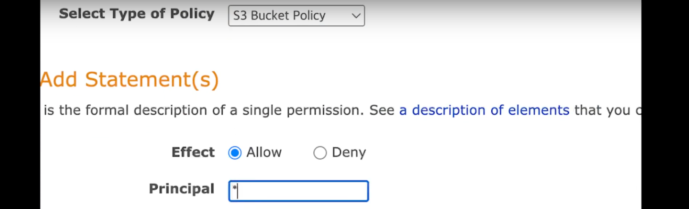
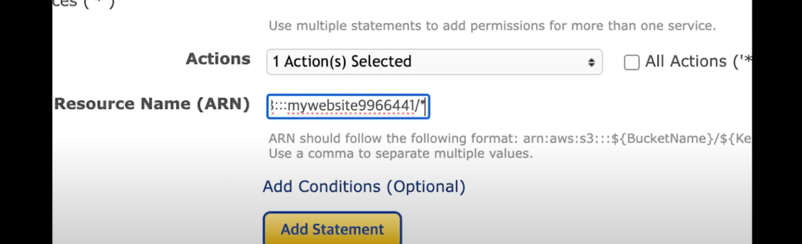
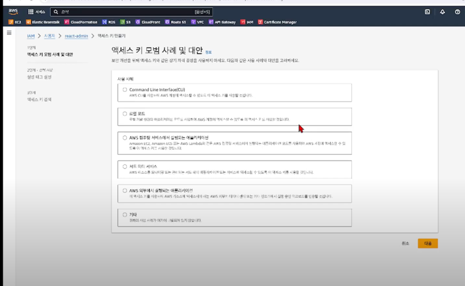

인덱스 문서 index.html

오류문서 error.html

로 적기

객체에 파일 올리기 html,css

버킷 - 권한 탭

버킷 정책 -편집
정책 생성기

액션은 getobject
arn은 이전탭에서 복사 붙이기 하고
/* 추가

그다음 add statement
generate policy 
하고 나온 거 복사 
이전 탭에 복붙
저장

속성 
맨아래 가서 사이트 누르면
사이트가 접속될거다~!~!~!

---
S3의 로그는 같은 버킷에 저장하면 안된다~!
로그 버킷은 다른 곳에 두고 써라~!

---
사용자 재생성 방법

이름 넣고 매니지먼트 클릭
Iam 사용자를 생성하고 싶음 클릭

암호 설정
다음 권한은 s2 full 하고 나머지는 기존 처럼
루트 계정으로 생성된 아이디에
액세스 키 만들기

CLI 
사실 아무거나 해도 됨!

액세스키 나오면 잘 저장해둬라🌟
완료 하고 
보안 정책 콘솔 로그인 링크로 로그인~!

그리고 s3 으로 가서 버킷 만들기
하고 위에 적었던거 반복
해서 버킷 만들기~!

다음 -2.2 패키징 이어서...
