### S3 One Zone-IA(빈번하지 않은 액세스용)
ㄴ한군데만 저장

ia = 빈번하지 않은 액세스

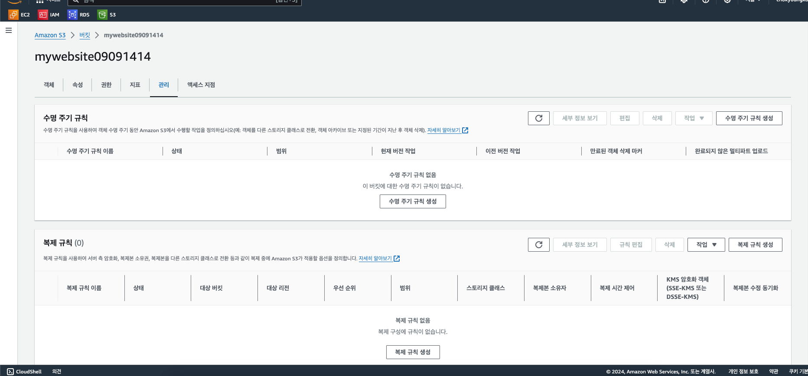
수명 주기도 설정 가능하다.
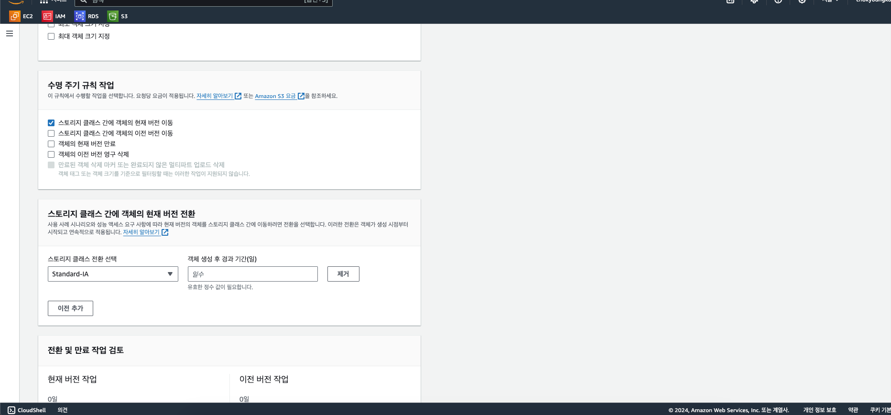


---
배포를 위한 세팅\'
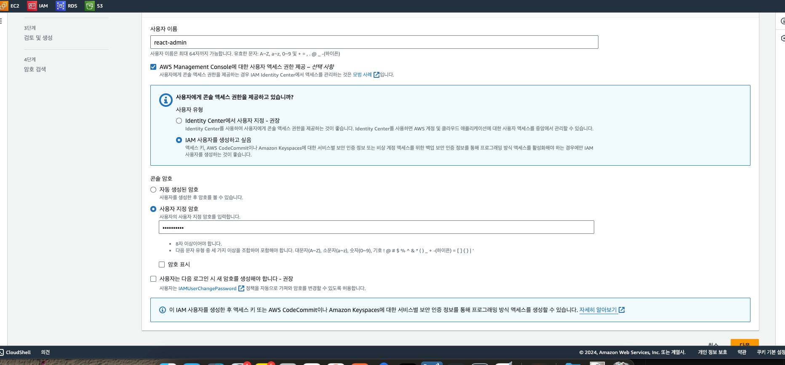

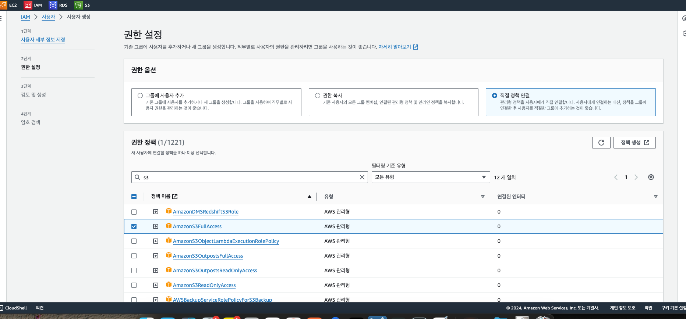
s3 full

보안정ㅊ택
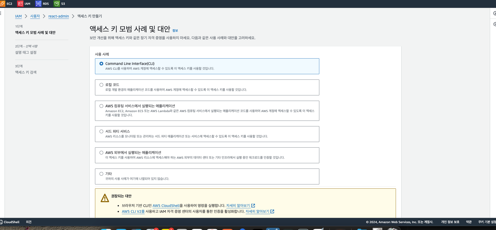
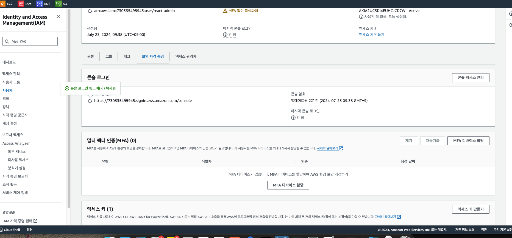

==>
### 패키징
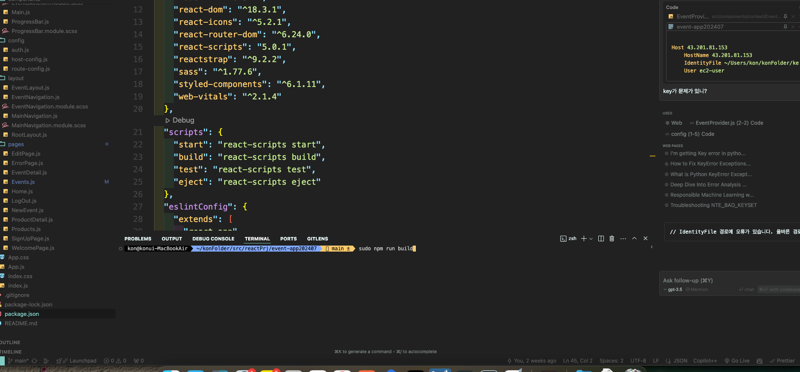
ㄴ패키징
kon@konui-MacBookAir  ~/konFolder/src/reactPrj/event-app202407   main ± 
sudo npm run build
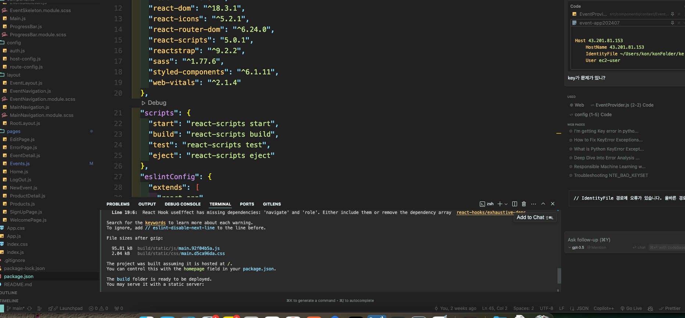
ㄴ완료 콘솔
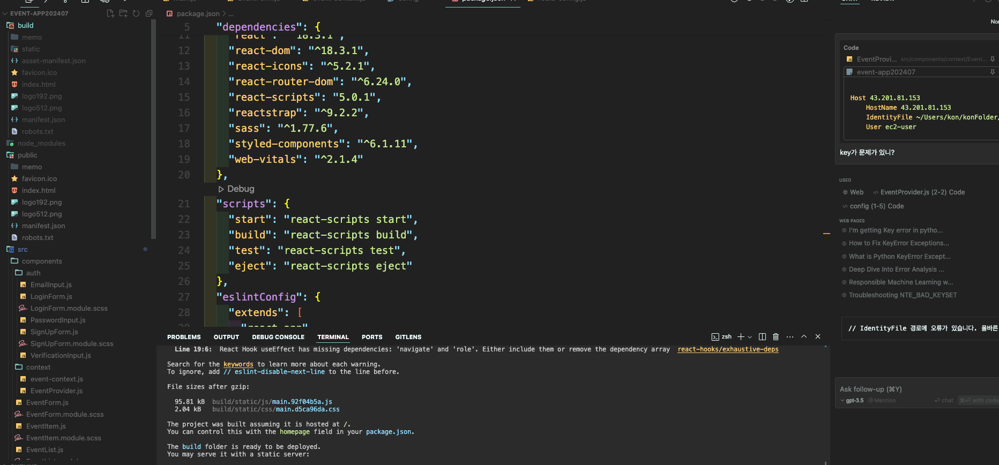
ㄴ빌드 폴더 생김
(css 와 메인을 한곳에 다 모아서  출력해준다)
빌드 폴더 안에 있는 것들을 s3 버킷으로 넣어준다

바로 동작은 안한다
연결된 config
```dtd
clientHostName ===
"mywebsite090909.s3-website.ap-northeast-x.xxxxxx.com"
 //앞에 http:// 떼고 적기 ! 🌟 s3 버킷 주소

) {
// backendHostName = "https://api.myapi.com";
backendHostName = "http://3.37.185.238:8989";
                // 호스트 네임은 http:// 붙이고 뒤에는 : 포트 번호 적기 🌟
}
```

---
## AWS CLI로 리액트 앱 배포하기
### 🌟자동 배포 시스템 구축 하기 
aws cli
 ㄴ 설치해서 쓰면 -> 깃 수정되면 자동 배포되는 파이프라인
https://aws.amazon.com/ko/cli/
MacOS PKG 설치 프로그램을 다운로드해서 실행합니다.

cmd
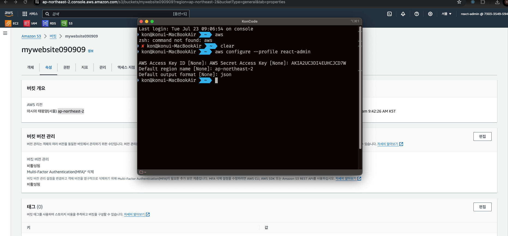
1회 인증하기 해야함
kon@konui-MacBookAir  ~  
[[⭐️명령어 하단꺼 ㄱㄱ ]] aws configure --profile 계정명
aws configure --profile react-admin

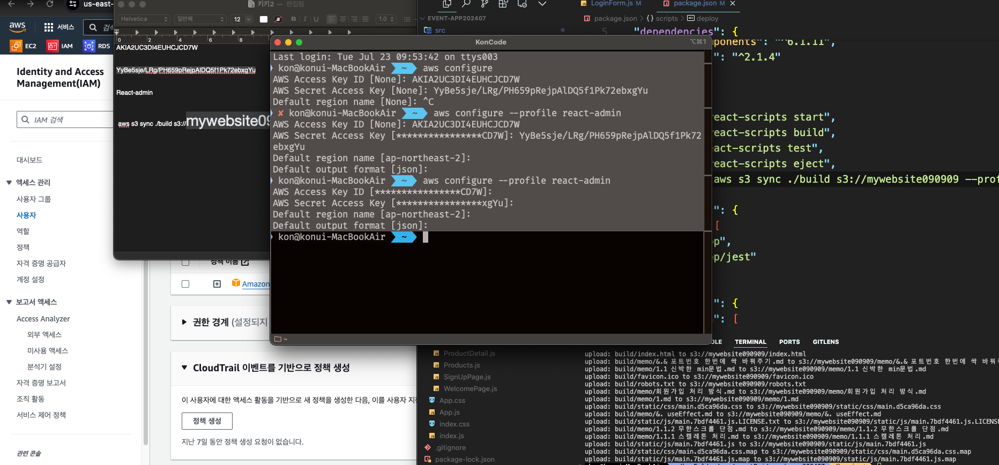
aws configure --profile 접근 아이디입력react-admin
AWS Access Key ID [****************CD7W]: 액세스키 넣기
AWS Secret Access Key [****************xgYu]: 시크릿 액세스키
Default region name [ap-northeast-2]: 지역
Default output format [json]:  형식넣기
키를 맞게 입력하기
//
리액트 쪽 패키지 제이슨에서 
...
"scripts": {
"start": "react-scripts start",
"build": "react-scripts build",
"test": "react-scripts test",
"eject": "react-scripts eject",
"deploy": "aws s3 sync ./build s3://자신의 버킷명  --profile=(접근계정명)react-admin"


//
### (수동으로 업로드 방법)
kon@konui-MacBookAir  ~  aws s3 sync ./build s3://s3버킷이름 --profile=아이디명
ㄴ 빌드한 것 라이트하기~!

### 오토 방식!
업로드 전 빌드 만들기 ㄱ
sudo npm run build

빌드한 것 업로드! ㄱ
sudo npm run deploy


