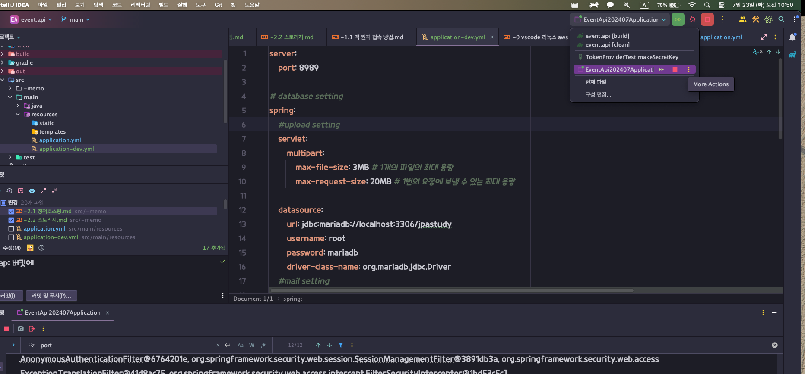
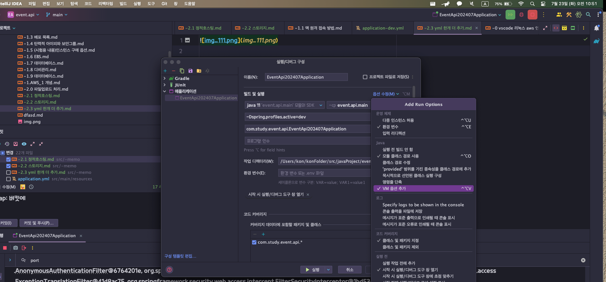
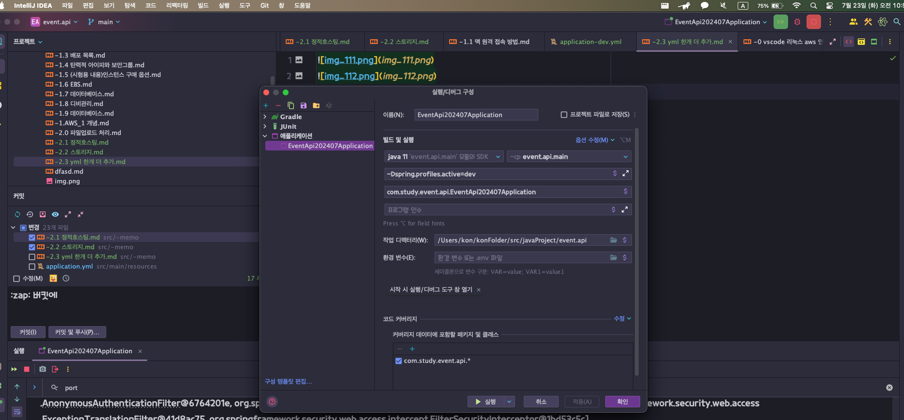
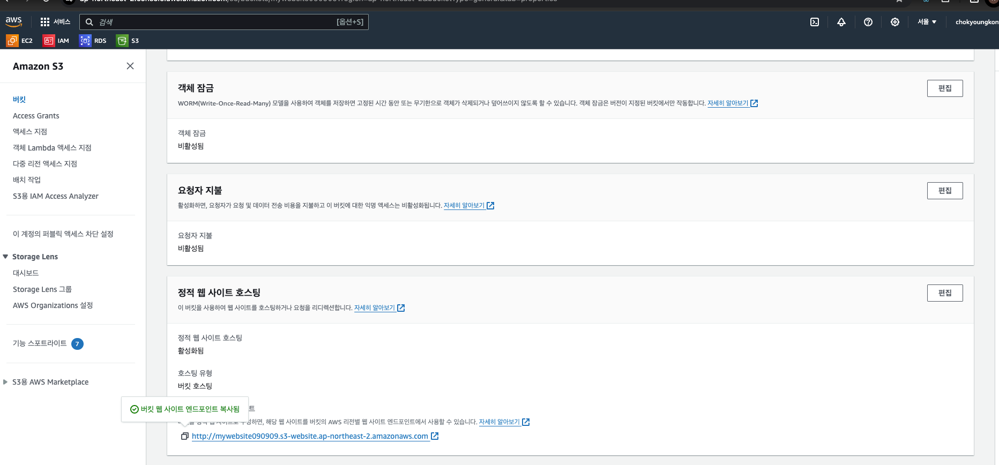
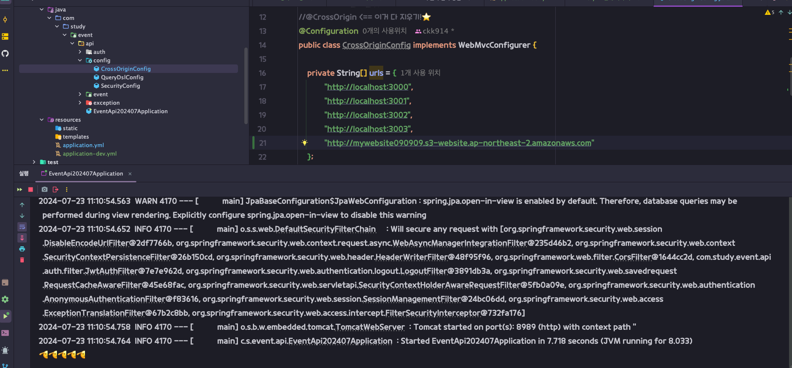

자바 깔기
sudo yum install java-11-amazon-corretto.x86_64

sudo yum install git -y
깃 깔기
[ec2-user@ip-172-31-0-184 ~]$ mkdir application
[ec2-user@ip-172-31-0-184 ~]$ cd application/

리액트에 허용하기 주소

배포 관련 오리진 추가 

yml 추가

chmod 777 gradlew

클린하기
./gradlew clean
빌드
./gradlew build

java -jar build/libs/event.api-0.0.1-SNAPSHOT.jar