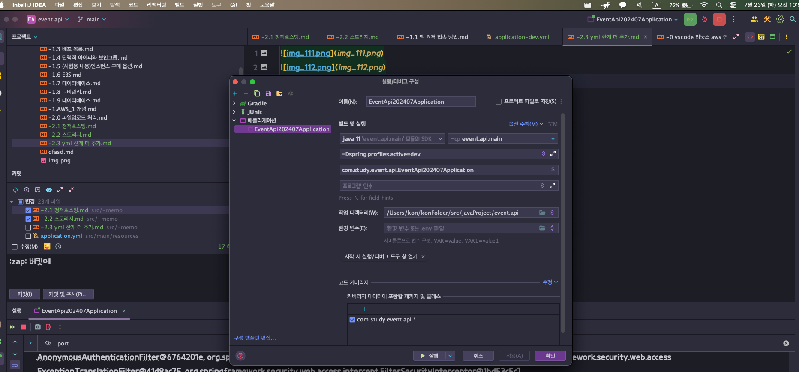
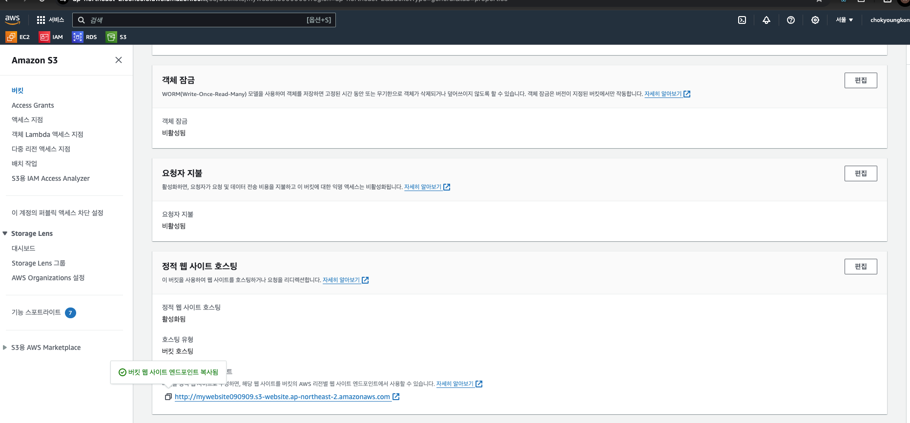
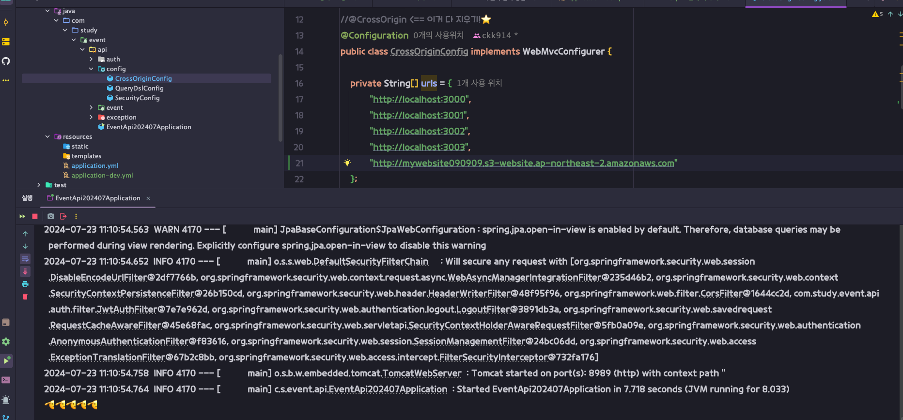

## 스프링 API EC2에 배포하기
yml   복사해서 
application-dev.yml 로 생성!

구성 편집

vm 옵션 추가
옵션 내용
-Dspring.profiles.active=deploy

---
    datasource:
        url: jdbc:mariadb://RDS 엔드포인트 주소 적기 🌟/데이터베이스명
        username: root
        password: mariadb1234
        driver-class-name: org.mariadb.jdbc.Driver


---
https://dev.to/aws-builders/installing-mysql-on-amazon-linux-2023-1512
4개 깔기  위 주소에서
Download the RPM file
Install RPM file
You need the public key of mysql to install the software.
If you need to install mysql client:
---
2. 디비 접속하기 리눅스~⭐️
   mysql -u root -p -h 아마존 데이터베이스의 엔드포인트 주소 적기!  
---

데이터베이스 만들기
---
자바 깔기
sudo yum install java-11-amazon-corretto.x86_64
---
깃 깔기
sudo yum install git -y

[ec2-user@ip-172-31-0-184 ~]$ mkdir application
[ec2-user@ip-172-31-0-184 ~]$ cd application/

해당 위치 깃 클론!@
 폴더 안으로 들어가기
cd src/main/resources/
touch application.yml
 vi application.yml 로 수정
i 눌러서 붙여넣고 , esc -> :wq  치고 닫기
ㄴyml 넣기
cd ../../..

 

리액트에 허용하기 주소


배포 관련 오리진 추가 

yml 추가
sudo su
//gradlew x (권한:x)을 주기 위함!
chmod 777 gradlew    

빌드 그래들로 이동
```dtd


//테스트 설정
tasks.named('test') {
//	useJUnitPlatform()                              //주석 처리⭐️
exclude '**/*' // 빌드 시 테스트를 생략       // 내용 추가⭐️
}

```
### 클린하기
./gradlew clean  
 ㄴ 인텔리제이에서  코끼리 그림에서 클린한 것과 같음. : 빌드 폴더가 사라짐
### 빌드
./gradlew build
ㄴ 소스코드를 패키징하는 것(묶음)


그냥 폴더 위치에서 아래 명령어 치기~!
스프링 실행하기🌟
java -jar build/libs/event.api-0.0.1-SNAPSHOT.jar
nohup java -jar build/libs/event.api-0.0.1-SNAPSHOT.jar &
이걸 했으면 배포가 된거다~!
실행되면 nohup.out 파일이 생김


접속 방법
http://Ec2탄력적ip:포트넘버/auth/check-email?email=hsg9984@gmail.com
이메일 인증 보내보기

아마 안될거임

ec2 가서 포트 열어주기 8989
ec2 보안 -보안그룹-인바운드 규칙 편집

규칙추가 포트 8989 , anywhere
 ㄴ 또는 yml 에서 포트 바꿔주기

