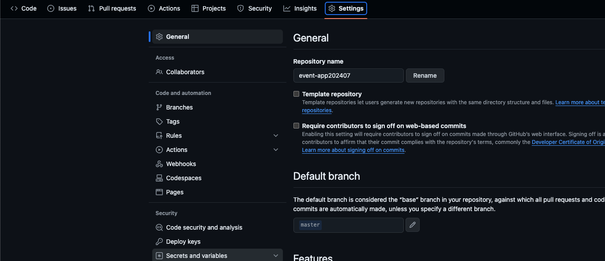
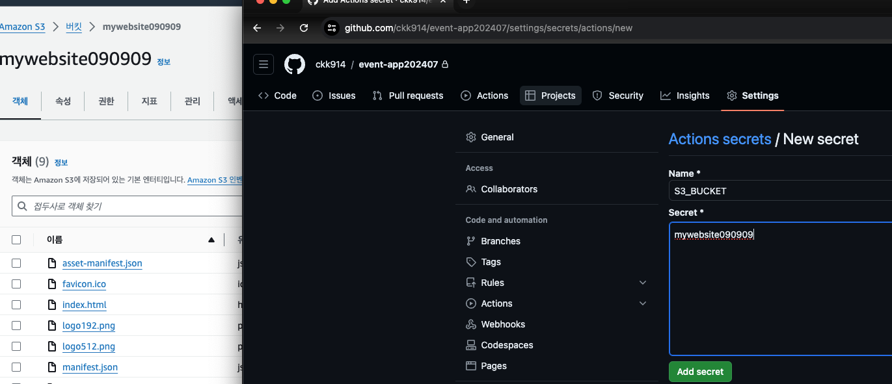
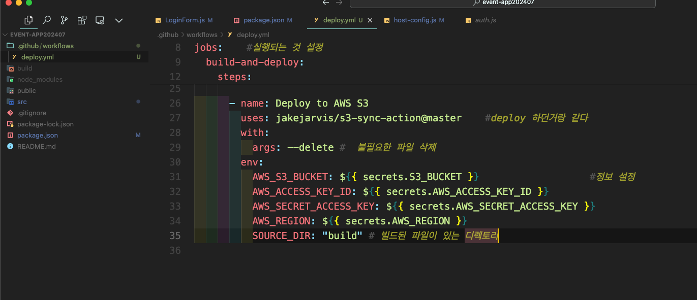
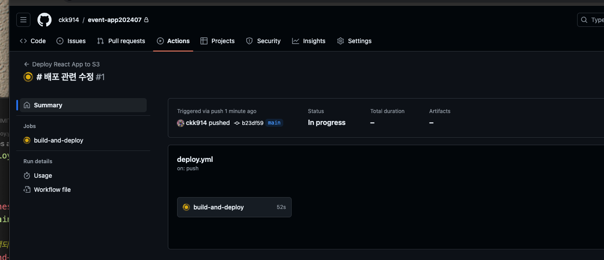
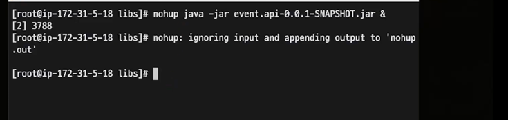
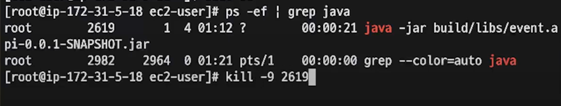

오픈 소스임 (잰킨스)
jenkins는 오픈 소스 자동화 서버
- Jenkins를 사용하면 서버에 직접 설치해야 하며, 유지 관리가 필요합니다. 
- 대규모 시스템에 맞게 확장할 수 있지만 설정과 관리에 시간과 노력이 많이 소요될 수 있습니다.
- Jenkins는 수년간 많은 개발자와 조직에 의해 사용되어 왔으며, 매우 강력하고 유연한 플러그인 시스템을 갖추고 있습니다.

GitHub Actions는 
설정이 간단하며, 소규모에서 중규모 프로젝트에 적합하고, GitHub 생태계와의 긴밀한 통합을 제공합니다.

### Jenkins와 GitHub Actions 사용

- Jenkins와 GitHub Actions는 **함께 사용할 필요는 없습니다**. 
- 둘 중 하나를 선택하여 프로젝트의 요구 사항과 팀의 기술적 선호도에 맞게 사용합니다.
- Jenkins는 매우 복잡한 시나리오에 적합하며, 기존에 Jenkins 시스템을 운영 중인 조직에서 선호될 수 있습니다.
- GitHub Actions는 GitHub과의 긴밀한 통합을 통해 CI/CD 파이프라인을 빠르고 쉽게 구축하고 싶은 팀에게 이상적입니다.

결국 선택은 개발 환경, 필요한 자동화 수준, 기존 인프라, 팀의 숙련도 및 예산에 따라 달라질 수 있습니다. 
예를 들어, GitHub을 활발히 사용 중이라면 GitHub Actions가 더 낫고, 더 복잡한 요구 사항을 다루어야 한다면 Jenkins가 적합할 수 있습니다.

깃허브 액션
1. 깃 레포지토리 간다음 
settings 클릭

   2. Secrets and nariables 클릭 -> 하위 항목 actions 클릭 
   화면에 뜬 것 중에 Repository secrets 에서 항목들 추가
          name                                           secret에 적기
   AWS_ACCESS_KEY_ID            : 접속에 필요한 키
   AWS_REGION                           : 접속 지역 
   AWS_SECRET_ACCESS_KEY   : 접속에 필요한 비밀키
   S3_BUCKET                               : 자신의 버킷명
   
리액트 프로젝트에 
.github/workflows 폴더 만들고
   그 안에 하위로
   deploy.yml 파일 만들기
   
```dtd
deploy.yml
name: Deploy React App to S3 #자유롭게 이름 짓기

on:
  push:
    branches:
      - main # main 브랜치에 푸시될 때 실행  (브랜치 명 적기)

jobs: #실행되는 것 설정
  build-and-deploy:
    runs-on: ubuntu-latest

    steps:
      - uses: actions/checkout@v4 # 리포지토리 코드 체크아웃      (원격저장소 코드 불러옴)

      - name: Set up Node.js
        uses: actions/setup-node@v4 # 리액트 빌드 위한 nodeJS 불러옴
        with:
          node-version: "20" # Node.js 버전 지정   (버전 명시)

      - name: Install Dependencies
        run: npm install # 의존성 설치

      - name: Build React App
        run: CI=false npm run build # 프로덕션 빌드 생성

      - name: Deploy to AWS S3
        uses: jakejarvis/s3-sync-action@master #deploy 하던거랑 같다
        with:
          args: --delete #  불필요한 파일 삭제
        env:
          AWS_S3_BUCKET: ${{ secrets.S3_BUCKET }} #정보 설정
          AWS_ACCESS_KEY_ID: ${{ secrets.AWS_ACCESS_KEY_ID }}
          AWS_SECRET_ACCESS_KEY: ${{ secrets.AWS_SECRET_ACCESS_KEY }}
          AWS_REGION: ${{ secrets.AWS_REGION }}
          SOURCE_DIR: "build" # 빌드된 파일이 있는 디렉토리

```



리액트에 설정파일 만들기


다하고 나면 깃허브 레포지토리 가서 액션 눌러보면
빌드 되고 있는 것을 볼 수 있다



---
스프링 실행할 파일 리눅스 안에 빌드된거 
build/lib 꺼 보면 event.api-0.0.1-SNAPSHOT.jar
이름이 특이한데 이유는 build.gradle 때문에 저렇게 됨!
```
group = 'com.study'
version = '0.0.1-SNAPSHOT'
sourceCompatibility = '11'
```
 /build/libs 폴더로 이동
명령어
nohup java -jar event.api-0.0.1-SNAPSHOT.jar &


ㄴ ec2 켜져있으면 백그라운드 실행
   인스턴스만 실행하면 됨
실행되면 
nohub.out 이라고 생김 파일
[root@ip-172-31-0-184 event-api202407server]# 
끝에서 200줄만 보는 명령어~!
tail -200 nohup.out


[root@ip-172-31-0-184 event-api202407server]# 
돌아가고 있는 프로세스 확인~!
ps -ef | grep java

[root@ip-172-31-0-184 event-api202407server]# 
돌아가고 있는 jar (java) 포트 킬~! 
kill -9 2927
