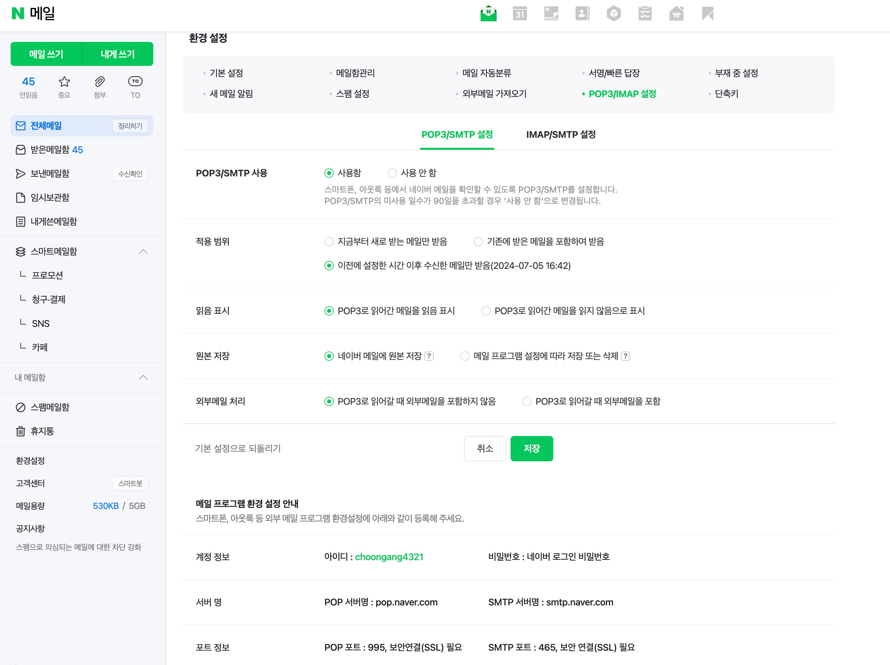

yml 에 스프링 밑에 추가하기~!
#mail setting
mail:
host: smtp.naver.com           //smtp 서버명 네이버 메일 설정 보면 있음!
port: 465                                  //smtp 포트 적기
username: 아이디 적기
password: 비밀번호 적기
properties:
mail:
smtp:
auth: true
ssl:
enable: true
starttls:
enable: true
default-encoding: UTF-8
debug: true

---
### 빌드 그래들에 추가할 것~ ⭐️
//이메일!
implementation 'org.springframework.boot:spring-boot-starter-mail'

//누구에게 이메일 보낼지
messageHelper.setTo(email);
